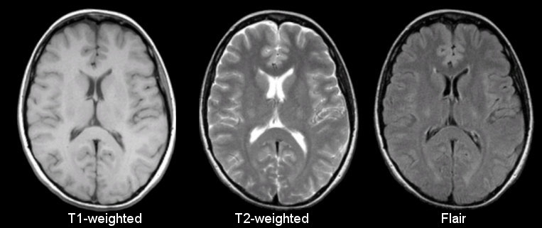

# BRAIN-MRI-VAE

## A Research Project 📚  
Using Generative models like Variational Autoencoder (VAE), <strong>T2-Weighted Images</strong>  are being generated from <strong>T1-Weighted Images</strong>. Have achived a maximumu of <strong>0.15 RMSE</strong>  on validation dataset.

 

# Sample Image

